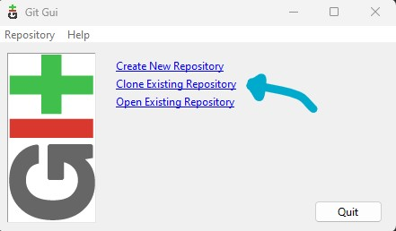
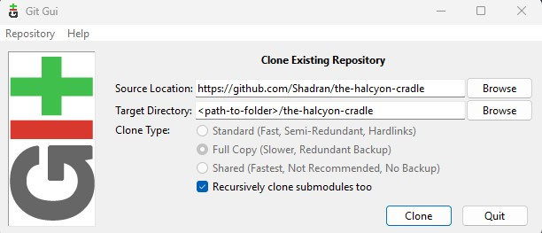
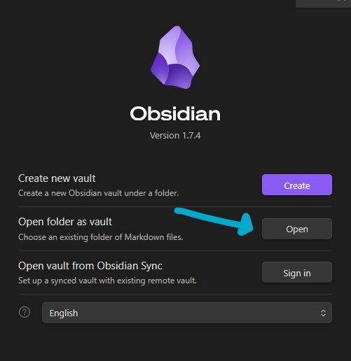
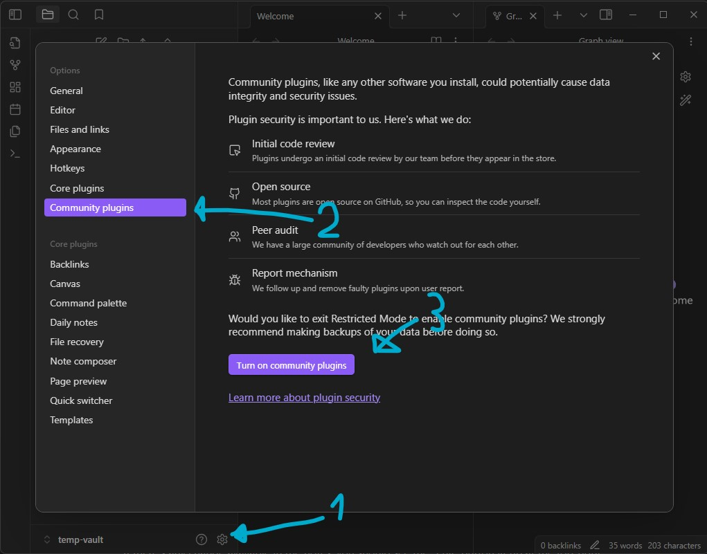
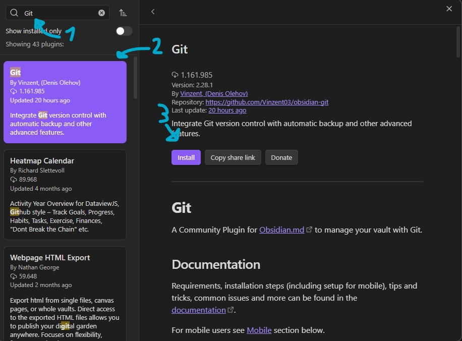

This is an Obsidian vault for the D&D Campaign The Halcyon Cradle, to allow players to organize and structure their notes.

## How to open

**Step 1:** Install [git](https://git-scm.com/download/win) from the official website. All recommended settings will do.

**Step 2:** Install [Obsidian](https://obsidian.md/), which is the program we use to see and edit the notes. 

**Step 3:** Type "Git" in your start menu, open "Git Gui" and select "Clone Existing Repository"  

  

  

**Step 4:** Open Obsidian and open the newly created folder as a vault  

**Step 5:** Install the Obsidian plugin "Git"  

Go to Community Plugins  
  

Press "Browse"  

Search, Install, and Enable the Git Plugin  
  

**Don't forget to hit "Enable" after installing!!**

If you have done everything correctly, you should be ready to go!

### These steps do NOT allow you to contribute
You will only be able to see what's in the notes and download updates! Any local change will NOT be synchronized with the notes on github, and will exist only on your local computer.**
See below on how to contribute.

### Syncing up changes

With Obsidian open, you should see a button with two lines-and-circles (if you hover over it, it should say "Open Git source control"). Click on it. 

If there's any change available in the notes, you should see the "Pull" button lit up at the top-right, in a newly opened panel (it's a downward arrow, classic "Download" button). By clicking on it, you'll sync up with any change made to the notes.

## How to contribute

Contributing requires you to fork the repository with your own github account, making whatever edit you want to make and creating a pull request on the original repo.

For detailed instructions on how to, contact me on Discord.
